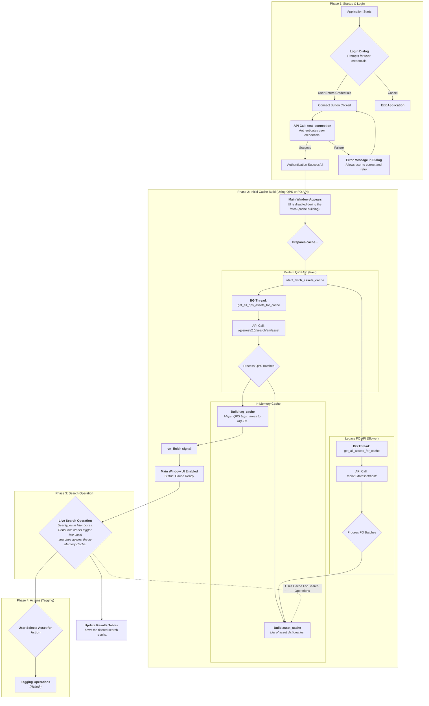

# Qualys Tool

A desktop application built with Python and PySide6 to provide a fast, responsive, and powerful interface for interacting with the Qualys Cloud Platform. This tool is designed to overcome the latency of web interfaces by using a high-performance local caching strategy, enabling instantaneous searching and filtering of thousands of assets.

## Details

-   **Modern GUI:** A clean and professional user interface built with PySide6.
-   **Secure Login:** The application will not start until a successful API connection is established.
-   **High-Performance Caching:** On startup, the application fetches all asset and tag data using the efficient, multi-threaded Qualys Platform Service (QPS) API. All subsequent operations are performed on this local cache.
-   **Instant, Live Filtering:** "As-you-type" filtering for both assets and tags. A debounce timer ensures the UI remains smooth and responsive even with thousands of assets in the cache.
-   **Parallel Data Fetching:** Includes support for both the modern `/qps/` API and the legacy `/fo/` API for fetching asset data, with the QPS method being preferred for its speed.
-   **Tagging Interface:** UI for single and bulk asset tagging is in place. (Note: The final API calls for these actions are currently halted).
-   **Robust Logging:** Detailed logs are written to `qualys_app.log` for easy debugging and auditing of all API interactions.

## Installation

### Prerequisites

-   Python 3.8+
-   A Qualys user account with API access and permissions for the Asset Management (AM) modules.

### Setup Instructions

1.  **Clone the repository:**
    ```bash
    git clone <your-repository-url>
    cd <your-repository-name>
    ```

2.  **Create and activate a virtual environment (recommended):**
    ```bash
    # For Windows
    python -m venv venv
    .\venv\Scripts\activate

    # For macOS/Linux
    python3 -m venv venv
    source venv/bin/activate
    ```

3.  **Install the required dependencies:**
    A `requirements.txt` file is included for easy installation.
    ```bash
    pip install -r requirements.txt
    ```

## GUI Usage for the Readonly API

1.  **Run the /fo GUI application:**
    ```bash
    python app.py
    ```

2.  **Login:** A login dialog will appear. Enter your Qualys username and password. The application will not proceed until it successfully authenticates with the Qualys API.

3.  **Initial Cache Build:** Upon successful login, the main window will appear with the UI disabled. The status bar will indicate that it is fetching all asset data. This is a one-time wait that builds the local cache. For an environment with ~6,000 assets, this may take 30-60 seconds.

4.  **Live Filtering:** Once the cache is built, the UI will become fully enabled.
    -   **Filter Assets:** Simply start typing in the "Filter Assets By" text box. The results table will update automatically as you type. You can switch between filtering by IP Address or Hostname.
    -   **Filter Tags:** Type in the "Filter Tags By" text box to see a live-filtered list of all unique tags found in your environment and the number of assets associated with them.

5.  **Tagging (Future):** Navigate to the "Single Tagging" or "Bulk Tagging" tabs to use the UI for preparing tagging operations.

## CLI Usage for the QPS API

1.  **Run the /qps CLI application:**
    ```bash
    python qps_test.py
    ```
    
Also a log file, `qualys_app.log`, will be created in the same directory when the application is run.


## Architecture & Workflow (You may not want to go through the code line by line so, here is how it works)

The application follows a "Fetch once, Search many times" architecture to provide a fast user experience.




